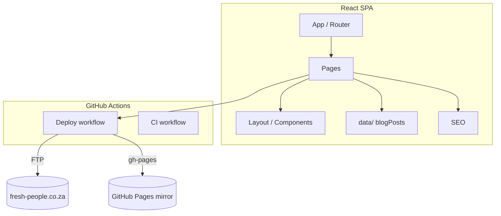

# Fresh People — Premier Talent & Events Staffing Johannesburg

> South Africa's premier talent agency for brand ambassadors, models, hospitality staff, event logistics and coordination.


**Live:** [https://fresh-people.co.za](https://fresh-people.co.za) · **Contact:** info@fresh-people.co.za · Randburg, Gauteng

Fresh People supplies world-class brand ambassadors, models, and hospitality
staff for events across South Africa. This repository contains the production
marketing website.

---

## Features

- **Home** — hero, value proposition, onboarding content.
- **Services** — talent categories and service detail pages.
- **Blog** — article listing + individual post pages with SEO.
- **About** — company story.
- **Contact** — contact page and details.
- **SEO** — built-in SEO component (meta, Open Graph, structured data).
- **Analytics counters** + FAQ + scroll-to-top UX.

---

## Tech Stack

| Layer | Technology |
| --- | --- |
| Frontend | React 19, Vite, TypeScript (mixed with JSX) |
| Routing | react-router-dom |
| Styling | Tailwind CSS, Lucide icons, Motion |
| Deployment | GitHub Actions → FTP (production) + GitHub Pages (mirror) |

---

## Architecture



Content lives in `src/data/`, components are reusable, and SEO is handled
centrally. Two deploy paths run from git: the live site (FTP) and a GitHub
Pages mirror.

---

## Getting started

### Prerequisites

- Node.js 18+ (20+ recommended)
- npm

### Local development

```bash
npm install
npm run dev
```

### Build & preview

```bash
npm run build
npm run preview
```

---

## Deployment

> **fresh-people.co.za is a live production site.** Deployment happens
> automatically on push to `main` via `.github/workflows/deploy.yml` (FTP to
> `public_html`). The deploy pipeline and hosting config are **not modified** by
> this hardening pass.

Deploy is triggered automatically:

```bash
git push origin main
```

A GitHub Pages mirror is also published from the same push
(`.github/workflows/deploy-gh-pages.yml`).

---

## Folder structure

```
fresh-people-co-za/
├── src/
│   ├── App.jsx / main.tsx / index.css
│   ├── pages/           # Home, Services, ServiceDetail, About, Blog, BlogPost, Contact, NotFound
│   ├── components/      # Navbar, Footer, Layout, SEO, FAQ, PageHero, StatsCounter, ScrollToTop
│   ├── data/            # blogPosts.js
│   └── lib/             # utils.ts
├── public/
├── .github/workflows/   # deploy.yml, deploy-gh-pages.yml, ci.yml
└── AUDIT.md
```

---

## Contributing

See [CONTRIBUTING.md](./CONTRIBUTING.md), [CODE_OF_CONDUCT.md](./CODE_OF_CONDUCT.md),
and [SECURITY.md](./SECURITY.md).

## License

[MIT](./LICENSE) © 2026 YassinAliYassin
